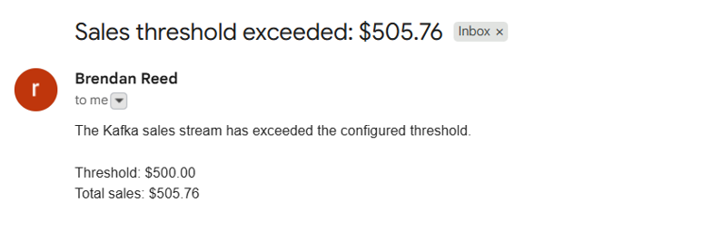

# Streaming Data

This site provides documentation for this project.
Use the navigation to explore module-specific materials.

## How-To Guide

Many instructions are common to all our projects.

See
[⭐ **Workflow: Apply Example**](https://denisecase.github.io/pro-analytics-02/workflow-b-apply-example-project/)
to get these projects running on your machine.

## Project Documentation Pages (docs/)

- **Home** - this documentation landing page
- **Project Instructions** - instructions specific to this module
- **Your Files** - how to copy from examples and make them yours
- **Glossary** - project terms and concepts
- **API** - autogenerated look at the code interface

## Custom Project

### Dataset

The Kafka producer streams records from `data/sales.csv`. Each row is a sales
transaction with an order id, timestamp, region, currency, product, unit price,
quantity, online flag, customer id, new-customer flag, device type, payment
method, referral source, discount code, and customer note.

I used the original sales dataset for this project. The data models individual
course-product purchases across several regions and payment channels.

### Kafka Messages

The producer sends one sales record at a time as a Kafka message. Each message
contains the fields from the source CSV record after validation.

The configured Kafka topic is `streaming-06-scenarios-case`. The message key is
the `region_id`, which keeps sales from the same region grouped consistently by
Kafka partition. I did not change the producer message fields from the source
sales dataset.

### Consumer Processing

The consumer receives sales messages from Kafka, validates the required fields,
and enriches each valid record with derived values. It calculates `subtotal`,
`tax_amount`, and `total` by combining the sale information with regional tax
rates.

The producer is configured to send 10 messages, and the consumer can read up to
`CONSUMER_MAX_MESSAGES=1000` before stopping. During the run, the consumer logs
each accepted order, the order total, the running total sales, average sale,
minimum sale, and maximum sale.

Valid consumed records are written to `data/output/consumed_sales.csv` and
`data/output/sales.duckdb`. The consumed CSV keeps the main transaction fields
plus the derived fields and Kafka metadata: `_kafka_key`, `_kafka_partition`,
and `_kafka_offset`.

### Experiments

For the Phase 4 technical change, I customized the producer and consumer files
for my own project copy using the `*_reed.py` files. I also changed the local
producer setting so it streams 10 sales messages instead of only the smallest
default sample.

For the Phase 5 application, I added a Gmail notification workflow. The consumer
tracks running total sales and sends an email when total sales exceed the
configured threshold. The default threshold is `$500`, but it can be changed
with `SALES_ALERT_THRESHOLD` in `.env`. The destination email address is
configured with `SALES_ALERT_EMAIL`.

### Results

The producer sent 10 sales messages from `data/sales.csv` to Kafka. The consumer
read those messages from the beginning of the topic, enriched the valid sales,
updated the running statistics, wrote 10 consumed records to the output CSV, and
saved the records in DuckDB.

The running sales total exceeded the `$500` threshold during the stream, so the
consumer triggered the notification email logic. This turned the stream from a
passive logging example into a small automated alerting workflow.

**Resulting email:**

### Interpretation

The Kafka workflow showed how a static CSV can be treated as a stream of
business events. Instead of processing the whole file at once, the producer sent
sales one at a time and the consumer reacted to each event as it arrived.

My custom version adds a practical business alert. The original example focused
on validating, enriching, storing, and visualizing messages. My version also
monitors cumulative sales and notifies a configured recipient when the stream
passes an important threshold.

Watching messages move through Kafka made the producer-consumer separation
clear. The producer only needs to publish valid sales events, while the consumer
can independently calculate totals, persist selected fields, update analytics,
and trigger notifications.

For a business, this kind of stream can show sales momentum while transactions
are still arriving. The consumed messages provide business intelligence about
total revenue, average order size, regional sales activity, payment methods, and
the point at which revenue crosses a decision threshold.
